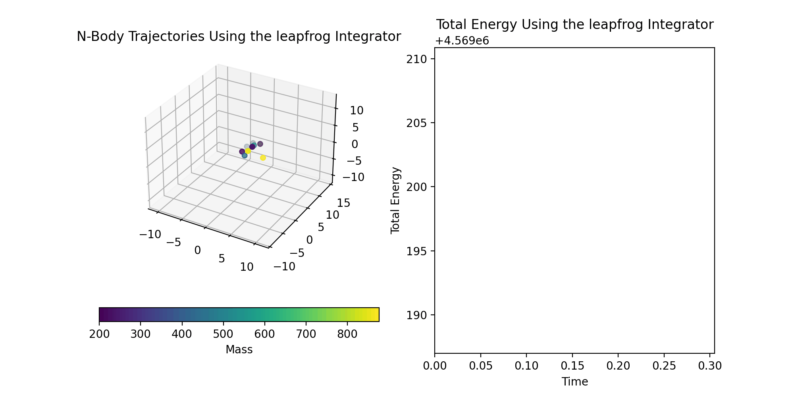

# N-Body Orbital Dynamics Simulation

This Python script simulates an N-body system using softened Newtonian gravity with RK4 and leapfrog integration methods. 

### Overview

This project simulates the evolution of an N-body system using numerical integration techniques, stores system properties at discrete timesteps, and produces a plot of the system's total energy and a 3D animation of the trajectories. Originally developed as a class assignment, it was independently expanded to refactor the workflow into an automated pipeline that generates initial conditions, simulation parameters, and output structures consistently for each run. It further analyzes the dynamical evolution of N-body systems and compares the long-term stability and energy conservation properties of different integration methods.

### Features

- N-body gravitational dynamics (softened Newtonian gravity)
- RK4 and leapfrog integrators
- Total energy conservation diagnostics
- 3D trajectory animation
- Reproducible simulations using random seeds

### Dynamical Model and State Representation

The system evolves under Newtonian gravity (assuming G = 1) with a softening parameter to stabilize local interactions. All quantities are expressed in dimensionless units.

The system state is stored as a flattened array consisting of interleaved positions and velocities: s = [x0, vx0, y0, vy0, z0, vz0, ..., xN, vxN, yN, vyN, zN, vzN], where x, y, and z are the position components and vx, vy, and vz are the velocity components.

### How the Code Works

1. **Initialization**
	
	- The simulation is initialized from the project root directory using `python simulate.py -N <int> -L <float> [--sigma <float>] [--seed <int>] [--output <str>]` where N is the number of particles to simulate, L is the length of the box enclosing the particles, sigma is the velocity dispersion, seed is the random seed, and output is the desired output directory.

2. **Simulation**

	- Initial conditions are generated using a fixed seed for reproducibility. Simulation parameters such as timestep and softening length are set prior to integration.
	- The initial state vector is passed to the numerical integrators, which evolve the system forward in time by updating the state vector iteratively until the dynamical time is reached.
	- The state vector is stored at discrete output steps during the integration.

3. **Visualization**

	- For each integrator, an energy vs. time plot is animated next to a 3D animation of the trajectories.
    - An example of the output is shown below:
    

	
	
### Future Enhancements

	- This script can be expanded to include more integration methods
	- The initial conditions can be adjusted to simulate systems with a dominant central mass

### References

    - Standard numerical integration methods (RK4, leapfrog) as described in *Computational Physics* (Mark Newman)